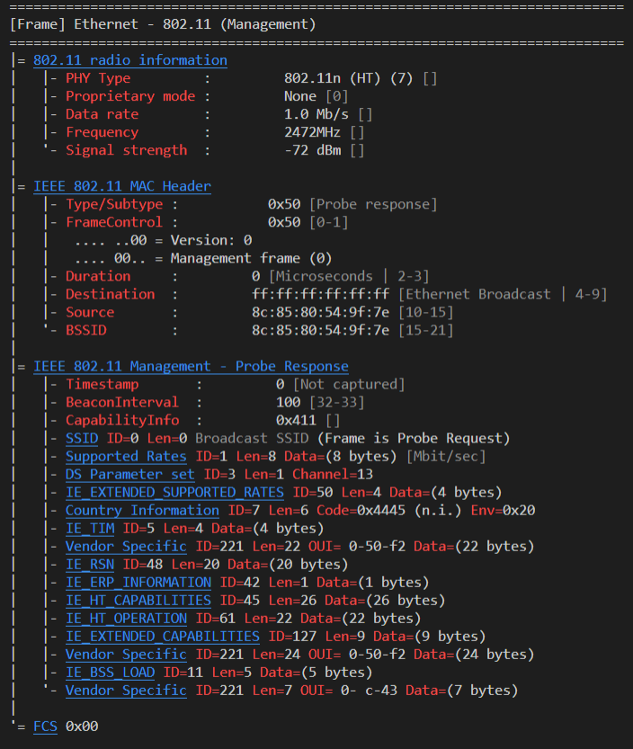

<div id="top"></div>

<!-- PROJECT SHIELDS -->
[![Contributors][contributors-shield]][contributors-url]
[![Stargazers][stars-shield]][stars-url]
[![Issues][issues-shield]][issues-url]
[![GNU GPL][license-shield]][license-url]

<!-- PROJECT LOGO -->
<br />
<div align="center">

<h1 align="center"><b>win32-native-wlan-api</b></h3>

  <p align="center">
    A native WLAN (Wireless LAN) API written in C to "sniff" <code>Beacon Frames</code> and some <code>Probe Response Frames</code>. Additionally, this API can be used to parse <code>Information Elements</code> stored in Management Frames from APs.
    <br />
    <a href="https://github.com/MatrixEditor/win32-native-wlan-api"><strong>Explore the docs »</strong></a>
    <br />
    <br />
    <a href="https://github.com/MatrixEditor/win32-native-wlan-api">View Demo</a>
    ·
    <a href="https://github.com/MatrixEditor/win32-native-wlan-api/issues">Report Bug</a>
    ·
    <a href="https://github.com/MatrixEditor/win32-native-wlan-api/issues">Request Feature</a>
  </p>
</div>

<!-- TABLE OF CONTENTS -->
<details>
  <summary>Table of Contents</summary>
  <ol>
    <li>
      <a href="#about-the-project">About The Project</a>
      <ul>
        <li><a href="#built-with">Built With</a></li>
      </ul>
    </li>
    <li>
      <a href="#getting-started">Getting Started</a>
      <ul>
        <li><a href="#prerequisites">Prerequisites</a></li>
        <li><a href="#installation">Installation</a></li>
      </ul>
    </li>
    <li><a href="#usage">Usage</a></li>
      <ul>
        <li><a href="#capture">A Simple Capture</a></li>
        <li><a href="#inspecting-frames">Inspecting 802.11 Frames</a></li>
      </ul>
    <li><a href="#roadmap">Roadmap</a></li>
    <li><a href="#contributing">Contributing</a></li>
    <li><a href="#license">License</a></li>
  </ol>
</details>

<!-- ABOUT THE PROJECT -->
## About The Project
---
To be able to show wireless APs and sniffing their capabilities on `Windows` additional libraries like `Winpcap` or Wireless Adapters which support the "monitor" mode are needed. 

This API makes use of the native Wlan-API provided by Windows which supports "receiving" `Beacon Frames` from other APs. Unlike other tools this API does **not** require administrator access to execute the declared functions.

<p align="right">(<a href="#top">back to top</a>)</p>

### Built With

* [MinGW](https://nuwen.net/mingw.html)
* Windows libraries: `wlanapi`, `Shlwapi`
* OS: Windows 7+

<p align="right">(<a href="#top">back to top</a>)</p>

<!-- GETTING STARTED -->
## Getting Started
---
This is an example of how you may give instructions on setting up your project locally.
To get a local copy up and running follow these simple example steps.

### Prerequisites

This is an example of how to list things you need to use the software and how to install them.
* At least `mingw-w64 7.0.0` available [here](https://nuwen.net/mingw.html) (**Any other C-Compiler should work as well**)
* You have the right OS: `Windows 7+`


### Installation

1. Clone the repo
   ```sh
   git clone https://github.com/MatrixEditor/win32-native-wlan-api.git
   ```
2. Install C-Compiler if needed
3. Compile different tests 
  
    a. With command:
   ```powershell
   your_compiler -fdiagnostics-color=always -g "win32-native-wlan-api\tests\<TEST_FILE>.c" "win32-native-wlan-api\win32\native\src\win32wlan.c" "win32-native-wlan-api\win32\native\src\win32pcap.c" "win32-native-wlan-api\win32\native\src\802dot11fmt.c" -o "win32-native-wlan-api\tests\<OUTPUT>.exe" -lwlanapi -lShlwapi
   ```
   b. With CMake:
   ```powershell
   # Not usable yet
   cd "...\win32-native-wlan-api\tests" && cmake "<CMAKE_FILE>"
   ```

<p align="right">(<a href="#top">back to top</a>)</p>

<!-- USAGE EXAMPLES -->
## Usage
---
### Capture
A first example shows how to capture `Beacon Frames` with the usage of this API: First, an internal session to query properties and start a WLAN scan is needed. This session can be created through the following method:

```c
HANDLE hClient;
if (GetSession(&hClient) != ERROR_SUCCESS) {
  // session could not be initialized
}
```

Before any packets can be captured the interface where the capture should be done has to be specified:

```c
WLAN_INTERFACE_INFO info;
if (GetInterfaceInfo(hClient, 0, &info) != ERROR_SUCCESS) {
  // interface not found (see method description 
  // for known errors)
}
```

To get the `InterfaceInfo` the previously defined session together with the index is needed. The program `iface-list.exe` in the `tools/` folder can be used to show all wireless adapters available.

Next, we have to register a callback function with the following structure:
> void _sample_callback_(PWLAN_NOTIFICATION_DATA, PVOID)

The `PWLAN_NOTIFICATION_DATA`  is a pointer to the `WLAN_NOTIFICATION_DATA` structure and the `PVOID` pointer contains the arguments defined in the next step. Here we are giving `hClient` as the `PVOID` argument to access the session in our callback_function.

```c
if (RegisterCallback(hClient, &callback_function, hClient) > 0) {
    // an arror occurred
} 
```

Now everything is prepeared to start capturing. **Important Note**: After the `StartCapture` macro there should be no more code because of the fact that the process is hooked after point with a `while`-loop. This step enables furthor notification handling through the defined callback function.

```c
// start "capturing"
StartCapture(hClient, &info.InterfaceGuid);
```

Lets have a quick look at the callback function. There are two ways to implement this function: 1. with the help of a pre-defined macro or 2. implementation by yourself.

1. To implement the callback function (name: `sample_callback`) with a macro:
    ```c
    // param names are: _Data and _Context
    ImplCallBackFn(sample_callback, {
      // code would be placed here
      // e.g. HANDLE hClient = (HANDLE)_Context;
    })
    ```
    There is also a macro called `DefCallBackFn` where you can define the callback function but implement it later on.
    ```c
    DefCallBackFn(sample_callback);
    // equal to
    VOID sample_callback(PWLAN_NOTIFICATION_DATA _Data, PVOID _Context)
    ```
2. Implementation by yourself: Just write a function that matches the `WLAN_NOTIFICATION_CALLBACK` parameter list and you are good to go.

### Inspecting Frames

The program `capture.test.exe` can be used to display all captured frames with the following output (example).

Though, colours are not supported by all terminals on `Windows` you can tell the program to use the default color-scheme with `--no-colour`.

**Note:** Information Elements with a fully uppercase name got no implementation for printing (default setting is used).




_For more examples, please refer to the [Documentation](https://example.com)_

<p align="right">(<a href="#top">back to top</a>)</p>

<!-- ROADMAP -->
## Roadmap
---
- [x] Print 802.11 Beacon Frames
- [ ] Save Frames to Pcap-Files
- [ ] Language support (maybe):
  - [ ] Java (JNI)
  - [ ] C++
  - [ ] Python 
  - [ ] Powershell/Batch -Scripts

See the [open issues](https://github.com/MatrixEditor/win32-native-wlan-api/issues) for a full list of proposed features (and known issues).

<p align="right">(<a href="#top">back to top</a>)</p>

<!-- CONTRIBUTING -->
## Contributing
---
Contributions are what make the open source community such an amazing place to learn, inspire, and create. Any contributions you make are **greatly appreciated**.

If you have a suggestion that would make this better, please fork the repo and create a pull request. You can also simply open an issue with the tag "enhancement".

1. Fork the Project
2. Create your Feature Branch (`git checkout -b feature/AmazingFeature`)
3. Commit your Changes (`git commit -m 'Add some AmazingFeature'`)
4. Push to the Branch (`git push origin feature/AmazingFeature`)
5. Open a Pull Request

<p align="right">(<a href="#top">back to top</a>)</p>

<!-- LICENSE -->
## License
---
Distributed under the GNU GP License. See `LICENSE.txt` for more information.

<p align="right">(<a href="#top">back to top</a>)</p>


<!-- MARKDOWN LINKS & IMAGES -->
[contributors-shield]: https://img.shields.io/github/contributors/MatrixEditor/win32-native-wlan-api.svg?style=for-the-badge
[contributors-url]: https://github.com/github_username/repo_name/graphs/contributors
[stars-shield]: https://img.shields.io/github/stars/MatrixEditor/win32-native-wlan-api.svg?style=for-the-badge
[stars-url]: https://github.com/MatrixEditor/win32-native-wlan-api/stargazers
[issues-shield]: https://img.shields.io/github/issues/MatrixEditor/win32-native-wlan-api.svg?style=for-the-badge
[issues-url]: https://github.com/MatrixEditor/win32-native-wlan-api/issues
[license-shield]: https://img.shields.io/github/license/MatrixEditor/win32-native-wlan-api.svg?style=for-the-badge
[license-url]: https://github.com/MatrixEditor/win32-native-wlan-api/blob/master/LICENSE.txt
[product-screenshot]: docs/example_capture.png